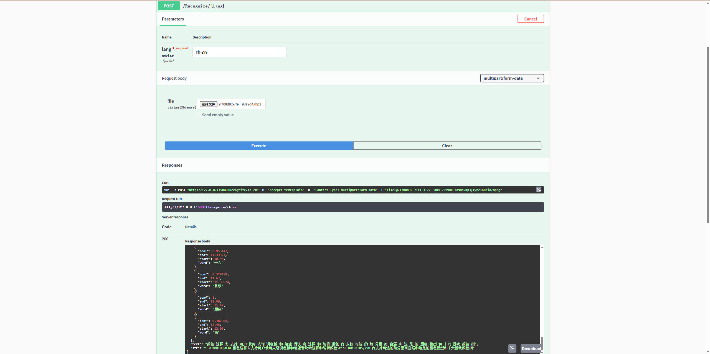

### 基于VOSK的离线中文语音识别的.Net Core Server
---

## 基本
本地Asp.Net Core WebApi, 上传文件进行语音识别

## Vosk
[Vosk说明](https://alphacephei.com/vosk/index.zh)

## 模型下载

[模型下载](https://alphacephei.com/vosk/models)

[通用Speaker模型](https://alphacephei.com/vosk/models/vosk-model-spk-0.4.zip)

## 修改来自
[VoskNetApi](https://github.com/surprise3465/VoskNetApi)

## 主要修改
- 同时支持多种模型  
- 升级到.net 8.0

# 添加其他模型
只需要在 dll/TextModel 中添加下载的模型即可，文件加的命名即为 controller 的lang参数。  
编译的时候会自动拷贝这些文件夹到debug或者release路径
# 基本效果  
swagger 调试  
- ja 日本語  
原文:
  おはよう、お嬢さん、笑ってもらえませんか？

- zh-cn 中文  
原文:
  颜色选择器支持用户使用光谱、调色板和组件滑块选择和编辑颜色。它还支持可选的 alpha 分量、RGB 或 HSV 颜色模型和十六进制颜色值。

## 评价 
小模型的效果比较一般
